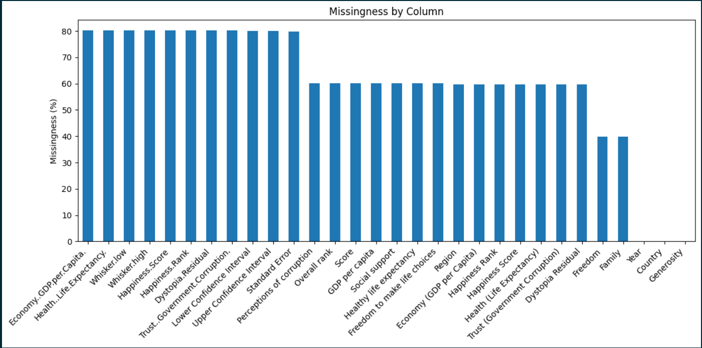
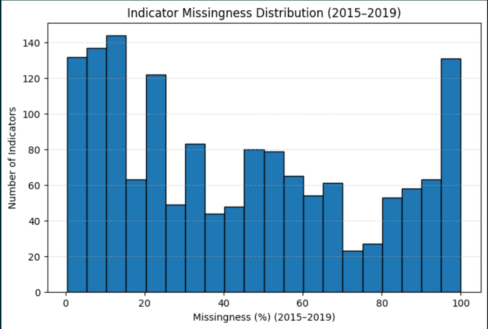
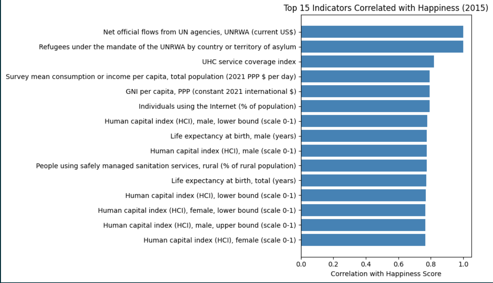
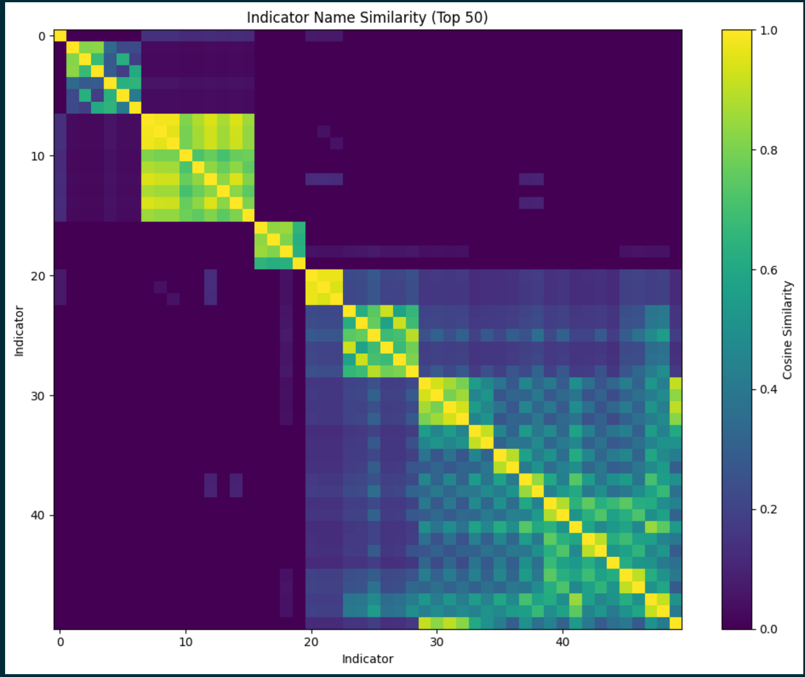
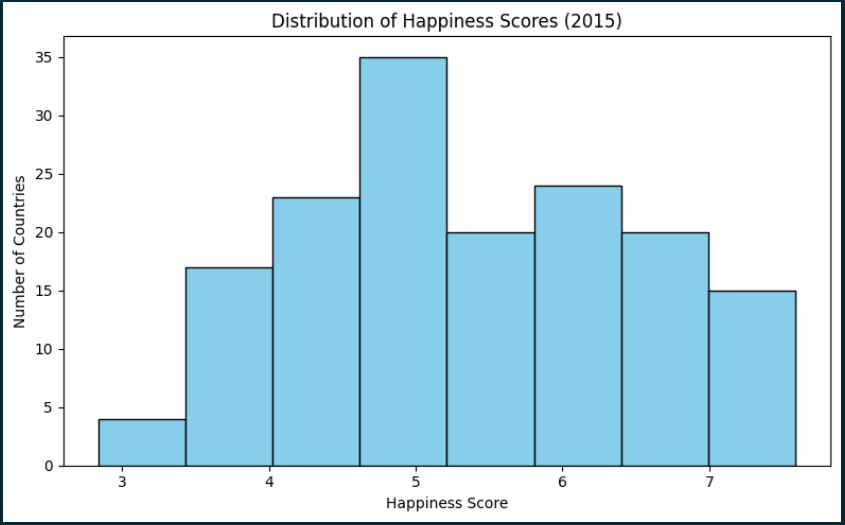

## Gather Data + EDA for Final Project
### Nick Perlich (nperlich@calpoly.edu)

### Description of Datasets and Why Chosen
I am using a combination of two public datasets: 
1) World Development Indicators from World Bank Group 
 
The World Development Indicators (WDI) dataset is "a comprehensive collection of global development data, providing key economic, social, and environmental statistics. It includes almost 1,500 indicators covering more than 200 countries and territories, with data spanning several decades." — World Development Indicators, Data Catalog, World Bank Group. The World Bank Group is an international financial institution that works to reduce poverty and support economic development around the world. The structure of the dataset is one row per country-indicator pair where an indicator is some variable that helps measure a country's development. Each row should have a value for that country-indicator pair from 1960 - 2024. This dataset is relevant because it can help discover what factors actually have an impact on a country's happiness which will help me in my goal of predicting country happiness scores.

2) World Happiness Report from kaggle 

The World Happiness Report (WHR) is a dataset that ranks between 150-160 countries by happiness score which is calculated through a combination of various indicators of happiness. It contains data for 2015-2019, covering factors such as family, life expectency, etc for the countries available in the report. The data comes from The Sustainable Development Solutions Network (SDSN), which is a global initiative launched by the United Nations to support and promote practical solutions for sustainable development. The structure of the dataset is one row per country, and each row has a happiness score as well as the values of the indicators used to calculate happiness scores. This dataset is relevant because it provides the target signal to help train my model when combined with the world development indicators per country. It also gives me some domain knowledge on which world development indicators will likely make good features.

### Learnings from EDA
#### Key Variables
The key variables are the indicators from the WDI and the Happiness Scores from WHR. Specific indicators I expect to be key are those that thematically overlap with those in the WHR such as ones relating to family, GDP, life expectancy, etc. To know which indicators will actually be key, I will need to perform feature importance analysis.
#### Data Volume
The WDI contains data for 266 countries and 1516 unique indicators. This means there are 403,256 rows. Each row contains a spot for the indicator value for the years 1960-2024 regardless of missingness. The WHR is split up into datasets for each year from 2015-2019. The number of countries (one row exists per country) varies from around 155-165 countries per dataset. There are 29 countries that do not appear in all 5 datasets, 170 countries total across all 5 datasets, and 151 countries that appear in all datasets.
#### Missingness
World Happiness Report:

This missingness is not fully accurate because some columns refer to the same variable with different names. After some cleaning, this level of missingness should decrease. The level of missingness for this dataset is not very relevant to my work because I am only using it for country happiness scores across the years.

World Development Indicators:

I only checked the missingness of WDI for the years 2015-2019 because those are the years I have target signal for. There are over 100 indicators that have little missingness. This number is inflated by indicators that are one indicator split into sections (i.e. population by age group and sex split into multiple indicators).
#### Potential Signals
Target Signals:

The target signal is very clearly the happiness score. My goal is predicting happiness scores for countries so it makes sense to use that value as my target signal.

Interaction Signals:

The interaction signal is pretty clearly the indicator value per country-indicator pair. Those values correlate with happiness score in some way that I plan to discover.

#### Potential Features

Although feature importance analysis will need to validate the actual features worth using, I am expecting the indicators from WDI that vary most with happiness scores to be the ones that overlap in concept with the indicators from the WHR. For example, the WHR has an indicator that represents a score for GDP, so I expect to see WDI indicators containing "GDP" in the indicator name varying with happiness score.

### Informative Visuals
#### Correlation

Combining happiness scores and indicators from WDI, I filtered to only data from 2015 as a start. I interpolated values that were missing for 2015 using a range of + or - 5 years. From that data, the above indicators were found to correlate most with happiness score. Some of them, such as life expectancy, I was expecting to see. My hypothesis was correct to some extent in expecting to see factors used in calculating happiness scores to show up as highly correlated with happiness. It is interesting to see an indicator about refugees being so highly correlated, but this makes sense from domain knowledge. It makes sense that countries with refugees would be happier because they would not be mandated to take in refugees if their population was not already taken care of to a high extent. These indicators that correlate highly with happiness score are a good start for the potential features used to train my model.

#### Grouping

Above is a heatmap showing similarity of indicator names. The grouping pattern makes sense given how the World Development Indicators are named and organized. Indicators that describe related ideas, such as different measures of GDP or various types of emissions, naturally cluster together because they share much of the same language. This shows that a significant minority of indicators are essentially measuring the same underlying concept, just through slightly different terms or methodologies. It reinforces the idea that while the dataset contains hundreds of indicators, some represent overlapping aspects of development rather than entirely distinct factors. Despite this, there is still a clearly significant amount of unique factors that individually measure development.

#### Distribution

This histogram is the distribution of happiness scores. The distribution looks like it is approaching normal. There could be class imbalances depending on how the data is split up, but I will be making a recommender which likely wouldn't have the issues of a classifier. I believe that for a recommender it should be beneficial to have a roughly normal distribution of data.

### Potential Challenges and Open Questions
#### Potential Challenges

The biggest challenge I expect to encounter is smartly sorting through more than 1000 potential features. It will be difficult to analyze which features are worth using and to perform the analysis correctly. I took first steps towards the full feature list analysis by only looking at one year's worth of data, and doing just that took significant effort. 

Another challenge will be creating my finalized dataset that combines 6 different parquet files. It might be difficult correctly merging them and transforming the data into how I want it to be represented for the actual training of my model.

One more challenge will be potentially dealing with missingness. It is possible that I will have enough features to choose from that don't have missing data. However, I do not want to miss out on features that have 80% coverage for example. I will need to find a safe way to fill in those empty data points without compromising my training and testing sets.

#### Open Questions
1) Which features matter the most for predicting country happiness scores?
2) What is the best way to handle missing data for the years I plan to use?
3) How much of an issue is missingness for the years 2015-2019?
4) How, if at all, should similar indicators be aggregated?

