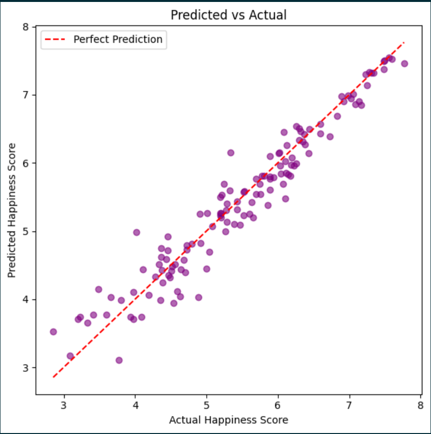
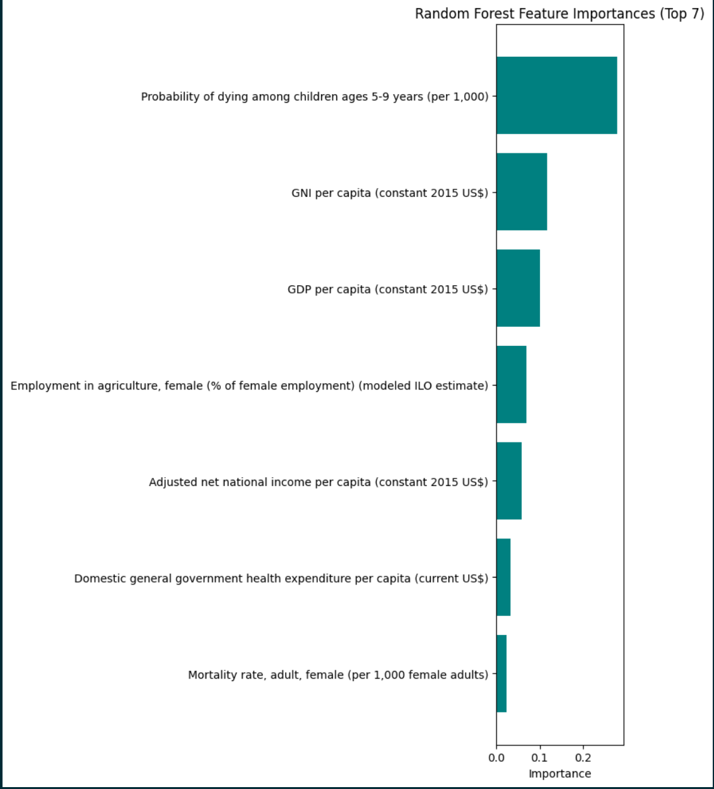

## First Draft of Final Project

### Nick Perlich (@nperlich@calpoly.edu)

### Evaluation of Model Evaluation
#### **Linear Regression**
- **MAE:** 0.9185  
- **RMSE:** 2.4843  
- **R²:** -3.7699  

---

#### **Dumb Income Regressor**
- **MAE:** 1.0457  
- **RMSE:** 1.3103  
- **R²:** -0.3268  

---

#### **Random Forest**
- **MAE:** 0.2197  
- **RMSE:** 0.2917  
- **R²:** 0.9342  

Linear Regression and Dumb Income Regression struggled on this dataset in finding a function for predicting happiness scores. Random Forest with max tree depth of 10 was able to score very well on Mean Average Error (MAE), Root Mean Squared Error (RMSE), and R^2 which were the metrics I felt were appropriate for the problem of predicting happiness scores based on world development indicators (WDIs). 

#### Random Forest Predicted vs Actual

The above plot is for random forest as the perfomance gap was large enough that I did not feel it was necessary to visualise the others. This shows that random forest found very strong correlation between certain WDIs and happiness of a country, and it was able to learn when trained on the data from 2015-2018 and tested on 2019.

#### Random Forest Feature Importance

#### Strengths and Weaknesses of Baseline
This feature importance chart validates my hypothesis that using country/population wealth indicators would have strong correlation with happiness scores. "GNI per capita" and "GDP per capita" were in the top 3 most correlated features with happiness of a country. This evidence is especially strong when considering that more than 700 indicators were available in the cleaned and complete dataset used for model training and testing. 

A weakness of my baseline model is that I assumed GDP and country happiness have a linear relationship. This led to my baseline model struggling more in evaluation than it possibly would have if I had checked the shape of the relationship between GDP and Happiness scores via scatterplot.

#### Possible Reasons for Error or Bias

For random forest, the mean error is 3%. I will need to look into the outliers of predicted vs actual scores to come up with a hypothesis as to what is happening with the countries that are getting inaccurate scores. However, in the general case, the model performs very well. Human bias might be the cause for these errors. It is possible that the creators of the World Happiness Report tweaked small values to align with their view of how the rankings should look. The same could be true of WDI values that lead the model to predicting wrong. Another possibility is that I need some more exploratory data analysis or hyperparameter tuning to optimize the model.

For linear regression and baseline, I think the main cause for both errors and bias in the model is that the features need to be engineered to fit a linear relationship. Currently, they are likely in a logarithmic relationship which a linear model could not accurately represent.

#### Ideas for Final Report
For the final project I have a few main steps I want to take:

1) Make scatter plots for GDP vs Happiness and GNI vs Happiness
2) Make scatter plots for Child Deaths (various age groups) vs GDP/GNI to see if child deaths are uniquely related to Happiness or just as a consequence of correlation with GDP/GNI
3) Feature engineer for linear regression and baseline using knowledge from feature importance + scatter plots
4) Look into outliers of the random forest predictions to potentially determine cause of those outliers
5) Validate quality of features using SHAP

